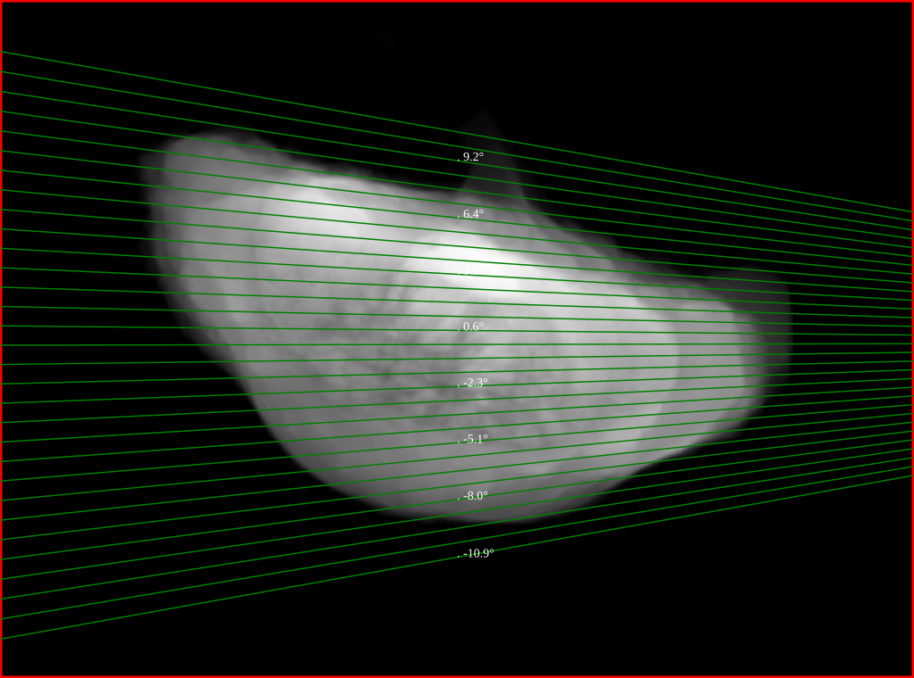
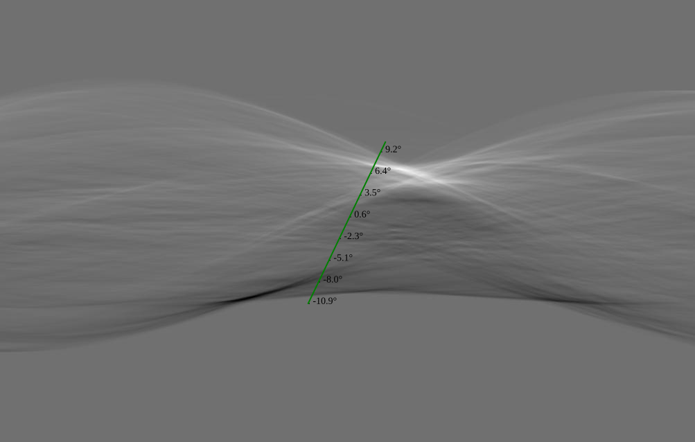
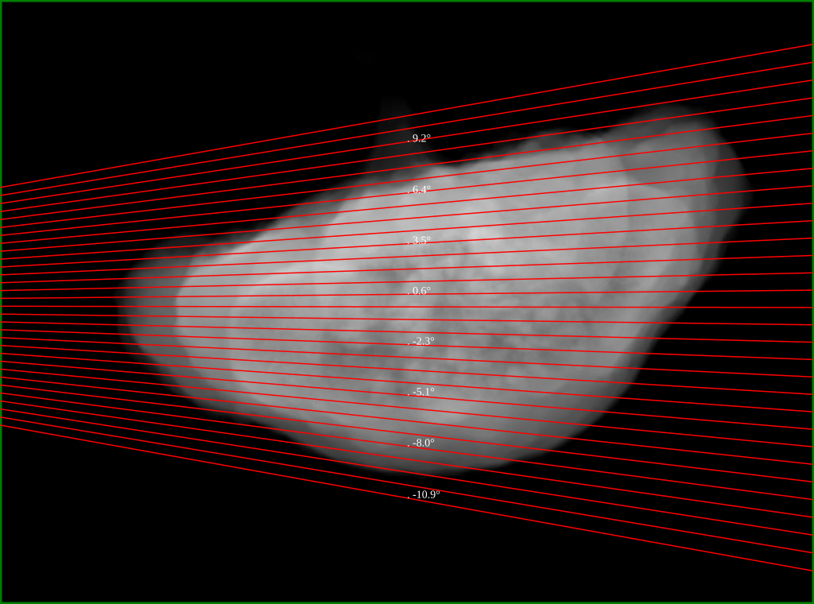
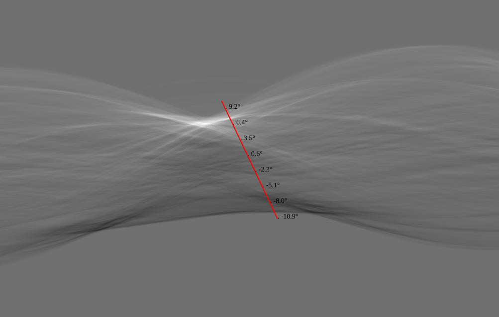
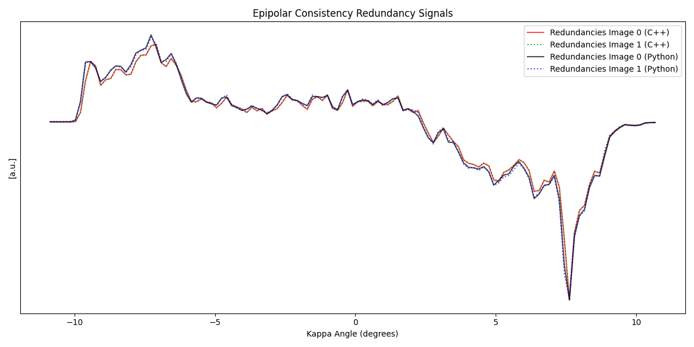
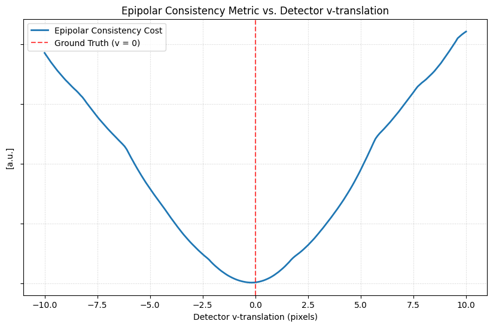
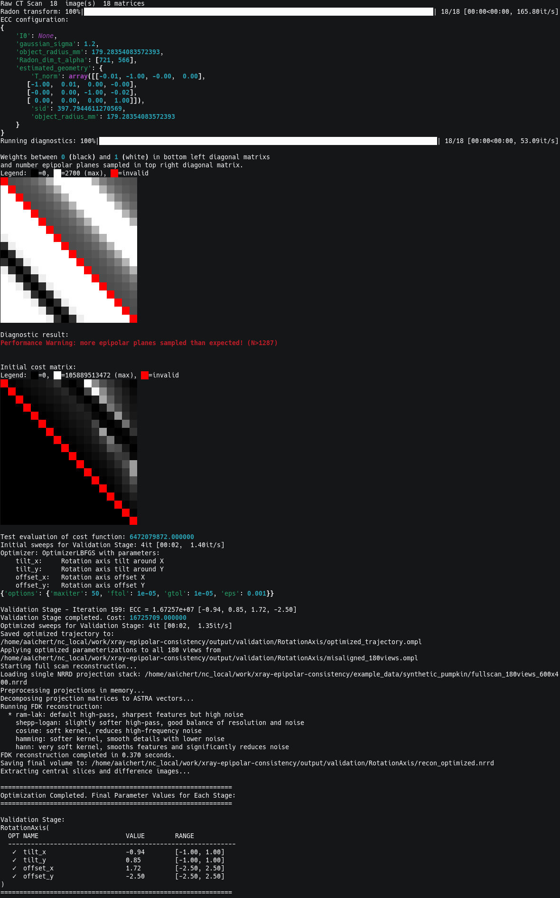
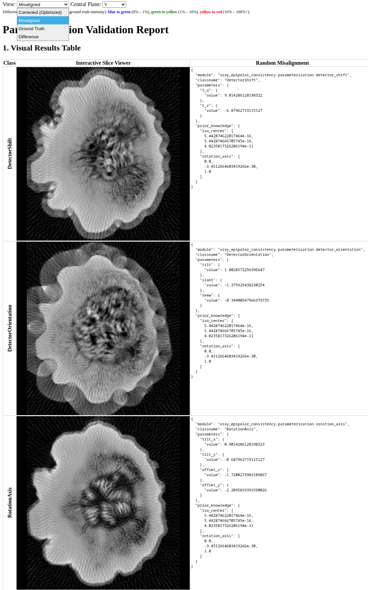
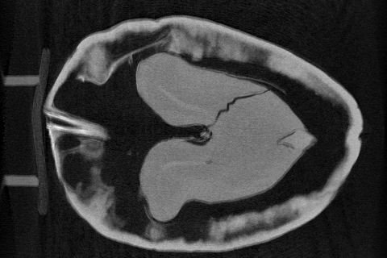
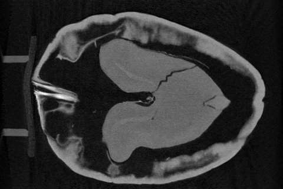

# Epipolar Consistency of X-Ray Images for CT Calibration Correction

 This repository provides a Python interface for the C++/CUDA implementation of the [Epipolar Consistency Conditions (ECC)](https://github.com/aaichert/EpipolarConsistency).
It is designed as an installable PIP package that compiles the underlying C++/CUDA code and exposes it directly to Python.

The CUDA wrapper exposes the fast implementation of the ECC cost function and comes with a CT calibration correction written in Python.
*Note: The GUI application is no longer included in this repository and will be hosted [in a separate repository.](https://github.com/aaichert/ct_calibration_correction_gui)*

<p align="center">
  <a href="https://www.youtube.com/watch?v=D3MwqmITM4M">
    
  </a>
  <br>
  <sub>📺 Click the preview above or <a href="https://www.youtube.com/watch?v=D3MwqmITM4M">here</a> to watch the <b>CT Calibration Correction GUI Demo</b>.</sub>
</p>


## Installation

### Build Prerequisites

The library requires CUDA for high-performance epipolar consistency computations. Building the CUDA version from source requires a C++ compiler, CMake, and the CUDA Toolkit.

**Ubuntu / Debian**
```bash
sudo apt update
sudo apt install build-essential cmake nvidia-cuda-toolkit
```

**Arch Linux / CachyOS**
```bash
sudo pacman -Sy base-devel cmake cuda
```

**Windows**
1. Install **Visual Studio** (e.g., Community Edition) and make sure to select the **"Desktop development with C++"** workload during installation.
2. Install **CMake** from [cmake.org](https://cmake.org/download/) (make sure to select "Add CMake to the system PATH" during installation).
3. Download and install the **CUDA Toolkit** from the [NVIDIA Developer website](https://developer.nvidia.com/cuda-downloads).


### Python Wrapper

You can install the Python wrapper once you have cloned the repository locally:

```bash
# 1. Create a virtual environment (we told git to ignore .venv)
python3 -m venv .venv
# 2. Activate it
source .venv/bin/activate
# 3. Install the package in editable mode
# This will trigger CMake, download Eigen, and compile the C++ code!
pip install -e .
# 4. Run the tests
pytest tests/
```

Alternatively, if you just want to use the cost function in your own code, you can install directly from GitHub:

```bash
pip install "git+https://github.com/aaichert/xray-epipolar-consistency.git"
```

### 3D Reconstruction Support (Required)

ASTRA-based 3D reconstruction and the companion `ct-recon-fdk-astra` package are now standard requirements for running geometry correction and validation.

To set up the required reconstruction support:

1. **Install the ASTRA Toolbox** (which `ct-recon-fdk-astra` depends on):

   * **Linux (CachyOS / Arch / Ubuntu / Debian / etc.)**
     ```bash
     pip install astra-toolbox
     ```

   * **Windows**
     Since official Windows `pip` wheels for ASTRA are not available:
     1. Download the precompiled binary zip archive matching your Python version from the [ASTRA Toolbox downloads page](http://www.astra-toolbox.com/).
     2. Extract the archive and copy the Python `astra` module directory into your python virtual environment's `Lib/site-packages` folder.
     *(Note: Ensure that you have the Microsoft Visual C++ Redistributable and the CUDA toolkit installed).*

2. **Install the `ct-recon-fdk-astra` Package** (installed automatically via `pyproject.toml` or `requirements.txt`).


## Epipolar Consistency Diagnostics

The example script `examples/plot_redundancy.py` demonstrates the geometry and correctness of C++ and Python-based pipelines. It computes pencils of epipolar planes, samples the Radon intermediate function (dtR) for a range of angles, and plots the resulting redundancy values.

Note that the values do not need to match exactly because very few samples are drawn from a lower-res representation in Python compared to C++.

### Visualizations

The table below shows the projection views overlaid with epipolar lines (left) and their corresponding sampling planes mapped to the $(\alpha, t)$ coordinates in Radon space (right).

| Projection View with Epipolar Lines | Radon Intermediate Space Trajectory |
|:---:|:---:|
| **View 0** (with View 1 epipolar lines)<br> | **Radon Space 0** (View 0 sampling path)<br> |
| **View 1** (with View 0 epipolar lines)<br> | **Radon Space 1** (View 1 sampling path)<br> |

- **Epipolar Lines**: Represent the intersection of 25 rotated epipolar planes (defined by the baseline and angle $\kappa$) with the image detector planes. The lines intersect at the epipoles.
- **Radon Space Trajectories**: The curves show the sinusoidal path that the epipolar lines form when mapped into the $(\alpha, t)$ coordinates of the Radon transform (each line is a point).

### Redundancy Signal Parity

Below is the comparison plot showing the redundancy signals computed by the C++ engine versus those sampled via the pure Python pipeline. The alignment indicates consistency in coordinate frames, geometry, and orientation (numerical identity is not expected here due to sampling differences).



### Parameter Sweep Diagnostic

The example script `examples/plot_metric.py` demonstrates using the exposed `MetricRadonIntermediate` class to perform a fast parameter sweep. It modifies the projection matrix of View 0 by applying a detector $v$-axis translation from $-10$ to $+10$ pixels and evaluates the epipolar consistency cost against View 40.

The resulting cost curve shows a distinct minimum at $v = 0$ (the ground-truth alignment), demonstrating the metric's sensitivity to geometric misalignment:



## Calibration Correction


### Synthetic Pumpkin Data

Please extract the synthetic projectoin data for the [synthetic_pumpkin dataset](example_data/synthetic_pumpkin).

The repository also contains a working implementation for calibration correction of CT data for a number of [parameters](xray_epipolar_consistency/parameterization.md). You can test it with the synthetic pumpkin data

```bash
ecc-correct xray_epipolar_consistency/tools/config/config_synthetic_pumpkin.json
```

### Validation

To validate the calibration correction pipeline across various parameterization classes (e.g., detector shifts, rotation axis, gantry angles), you can run the validation command. It simulates geometric misalignments, runs the geometry correction pipeline, and compiles the results into an HTML report:

```bash
ecc-validate
```

Screenshots:
<p align="center">
  
  
</p>


### Real Walnut Dataset

A real-world example can be downloaded by following the instructions here: [Walnut CBCT dataset](./example_data/20201111_walnut_raw_data). Once the images are in the right location, everything else is already set up to run:

```bash
ecc-correct xray_epipolar_consistency/tools/config/config_walnut_360_4x4.json
```


Results (misaligned (left) and corrected (right)):
<p align="center">
  
  
</p>

The result can be seen in this [Report](https://aaichert.de/public/walnut_360_4x4.html)

